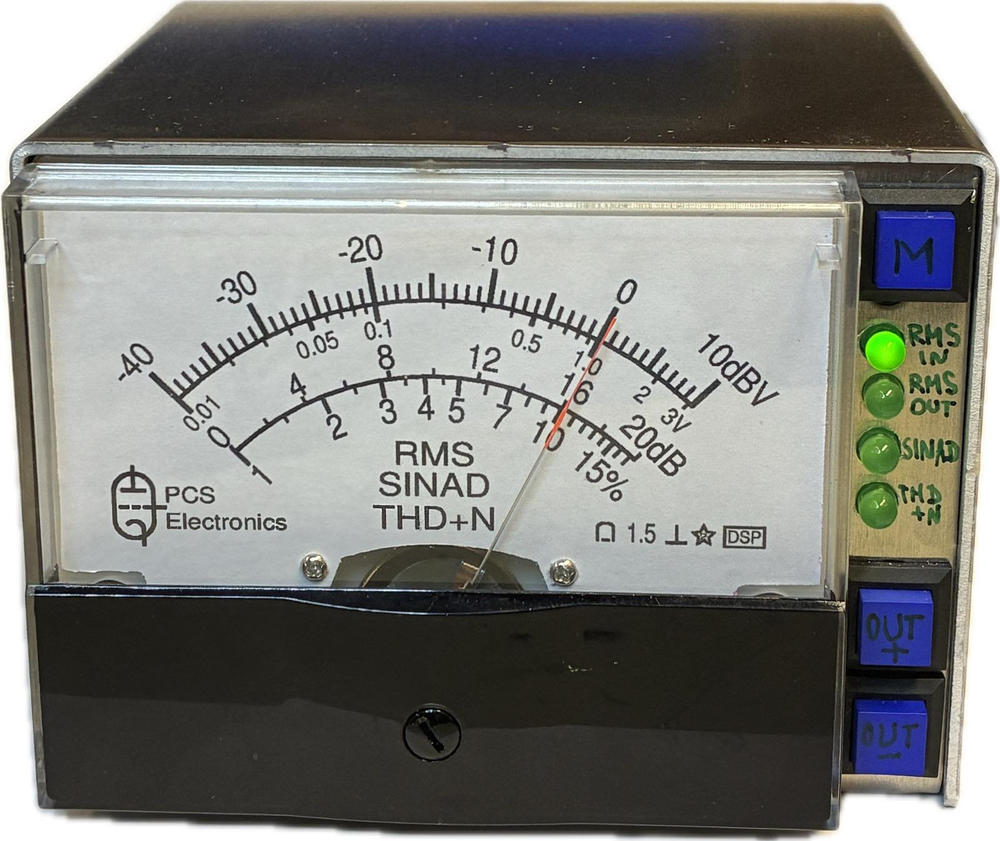
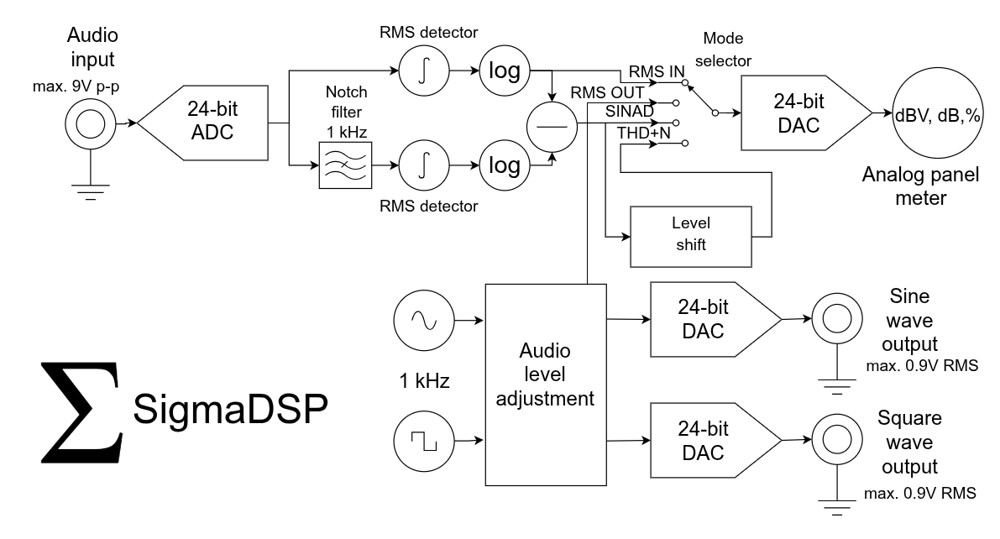
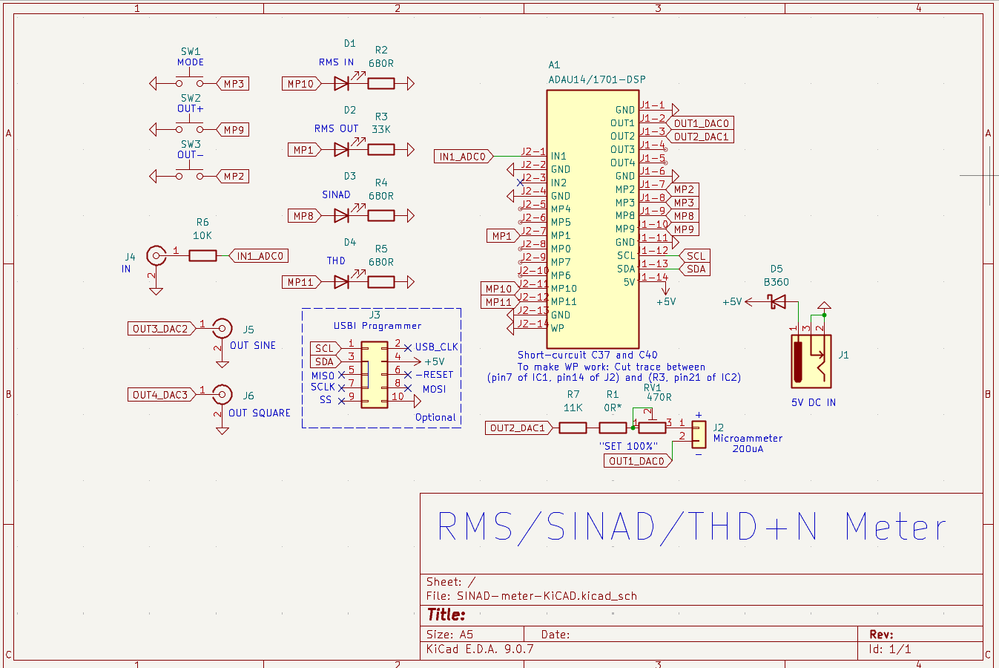
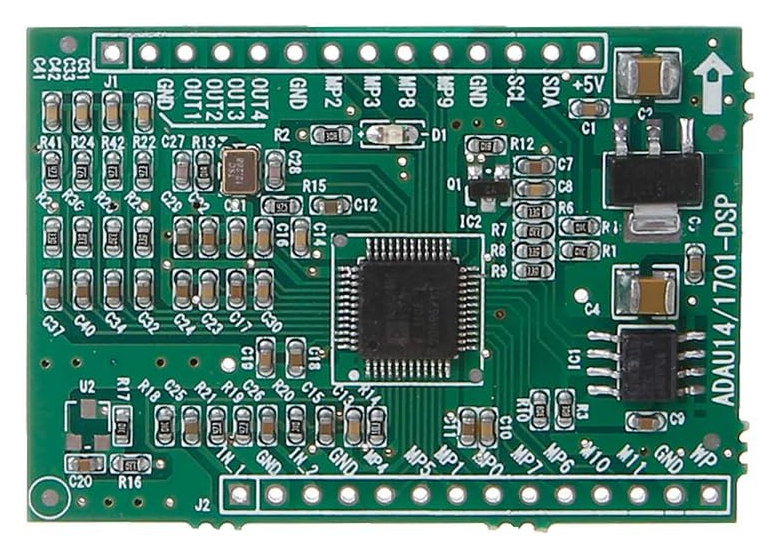
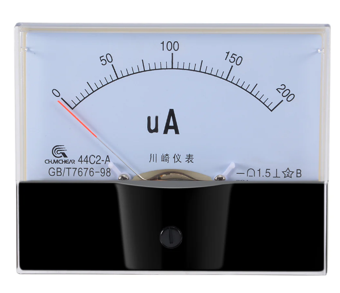
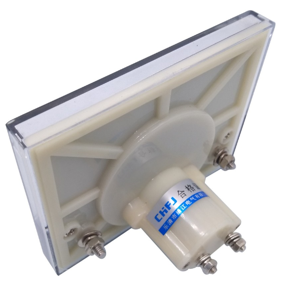
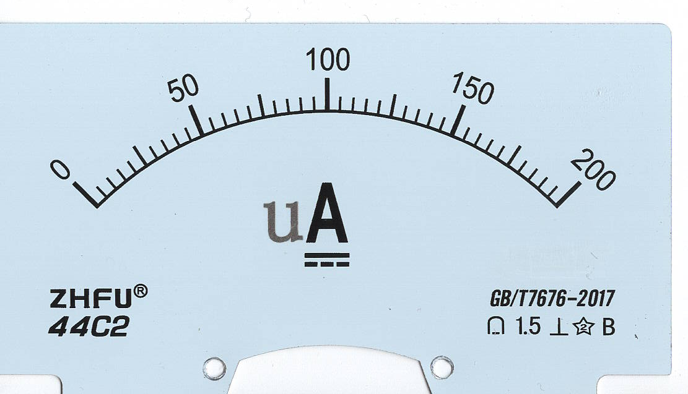
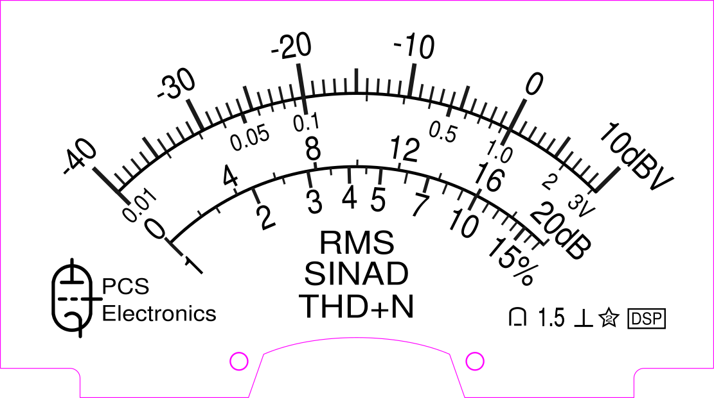

# DSP RMS / SINAD / THD+N Meter

A DSP-based audio test instrument built around the Analog Devices `ADAU1701` SigmaDSP. The project measures RMS level, SINAD, and THD+N on an analog panel meter, and also provides adjustable 1 kHz sine and square-wave test outputs.

**You may go directly to the user's manual section which contains principle of operation, characteristics, parameters as well as the use cases: [Manuals](Docs/)**

Below are the build instructions.

The repository contains the design documentation, SigmaStudio DSP project, KiCad hardware files, meter-scale artwork, and reference images used to build the instrument.

## What this project does

- Measures **RMS input level** in dBV on an analog meter.
- Measures **SINAD** by comparing total signal level to the residual after a 1 kHz notch filter.
- Measures **THD+N** from the same notch-filtered residual path.
- Generates **1 kHz sine** and **1 kHz square-wave** test signals.
- Lets the user change output level in **1 dB steps** with front-panel buttons.
- Uses the `ADAU1701` for the full signal path, so no external general-purpose microcontroller is required for the core meter functions.

## How it works

The input audio is digitized at **48 kHz** and processed inside the SigmaDSP:

1. One RMS detector measures the unfiltered input.
2. A second path removes the 1 kHz fundamental with a notch filter, then measures the remaining RMS level.
3. The firmware selects and scales these values to drive the analog panel meter as:
   - `RMS IN`
   - `RMS OUT`
   - `SINAD`
   - `THD+N`
4. Two DDS-based generators create the internal 1 kHz sine and square-wave outputs.

## Hardware view

The KiCad design shows a compact ADAU1701-based meter with front-panel switches, LED mode indicators, audio input/output connectors, a 5 V supply input, and a 200 uA panel meter connection.

A reference photo of an `ADAU1701` DSP board:

## Meter scale artwork

This project repurposes a small analog 44C2 200uA microammeter (although you may also use a 50 or 100uA version) and replaces its original scale with a custom RMS / SINAD / THD+N overlay.

Original scale:

Modified scale:

